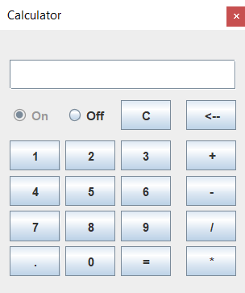
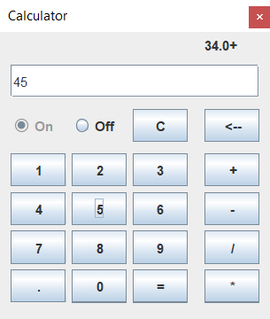
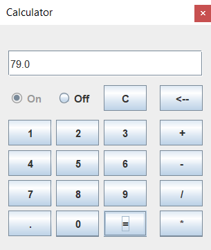
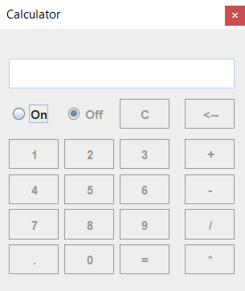

<h1>Calculator</h1>

<b>It is a simple Java Project using Java Swing.</b>

<h2>Introduction</h2>

A <b>calculator</b> is a project that performs arithmetic operations on numbers. The simplest calculators can do only <i><b>addition</b>, <b>subtraction</b>, <b>multiplication</b>,</i> and <b><i>division</i></b>.

<h2>Features</h2>
<ul type="square">
  <li>Addition</li>
  <li>Subtraction</li>
  <li>Multiplication</li>
  <li>Division</li>
</ul>  
<h2>Platforms Supported</h2>
<ul type="square">
  <li>Windows</li>
  <li>Mac OS</li>
</ul>  
<h2>Images</h2>
<table>
  <tr>
    <td> </td>
    <td> </td>
    <td> </td>
    <td> </td>
  </tr>
</table>  
